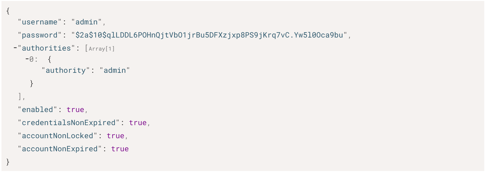

# SpringSecurity-OAuth2-授权码模式

http://localhost:8080/oauth/authorize?response_type=code&client_id=admin&redirect_url=http://www.baidu.com&scope=all

https://www.baidu.com/?code=RTPxLz

## 获取access_token

## 使用access_token获取资源

# SpringSecurity-OAuth2-密码模式

# SpringSecurity-OAuth2-JWT

